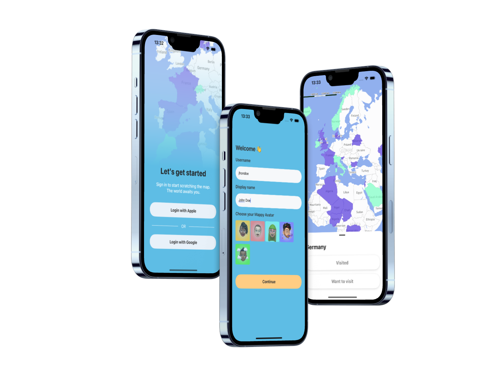
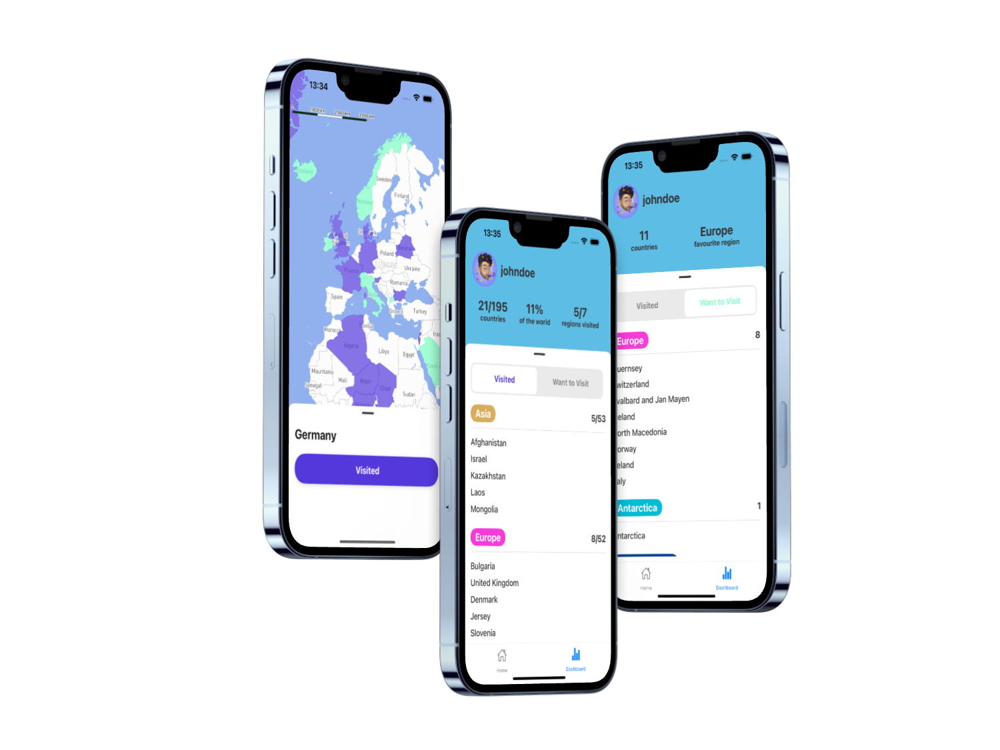

# Mappy

<p align="center">
  
</p>

Mappy is a mobile (iOS) travel scratch map app. an interactive map that lets you highlight the countries you have been to as well as mark the countries you want to visit. 

- Highlight countries that you've been to
- Highlight countries that you want to visit
- Dashboard view of countries
- Breakdown statistics of your travels

### Screenshots

<p align="center">
  
  
</p>

### Getting Started
Except for the regular suspects; git, Node, npm, you need these things to work on the Mappy app. Follow the instructions supplied below them or on their links to get them up and running before you continue with Installation.

Xcode (latest version, at least >16.0). Install from App Store.
[Cocoapods](https://cocoapods.org/) - a dependency manager for Swift and Objective-C Cocoa projects. sudo gem install cocoapods

### Installation
1. Clone the repo and enter:
#####
``` git clone https://github.com/salmon-01/mappy.git ```

##### Back-end environments:
Create a .env file
#####
```sh
SUPABASE_URL="your public supabase url"
SUPABASE_KEY="your public supabase key"
```

##### Front-end environments:
Create a .env file
#####
```sh
EXPO_PUBLIC_SUPABASE_URL="your public supabase url"
EXPO_PUBLIC_SUPABASE_ANON_KEY="your public supabase key"
EXPO_PUBLIC_MAPBOX_KEY=your public mapbox key (ex.: pk.ey...)
```

### Run the project

> [!IMPORTANT]
> Currently it is only possible to locally run the app with iOS simulator 
> Make sure you have latest version of XCode and CLI for project to run properly

##### Back-end

``` cd server ```
``` npm i ```
``` nodemon index.js ```

##### Front-end 

``` cd Mappy ```
``` npm i ```
``` npx expo start -c ```

Switch to development build by entering ``` s ``` in the terminal, then enter ``` i ``` to load the iOS simulator

## Tech Stack

- [React native](https://reactnative.dev/docs/environment-setup)
- [Expo](https://docs.expo.dev/) 
- [MapboxRN](https://rnmapbox.github.io/)
- Express
- [Supabase](https://supabase.com/docs)
